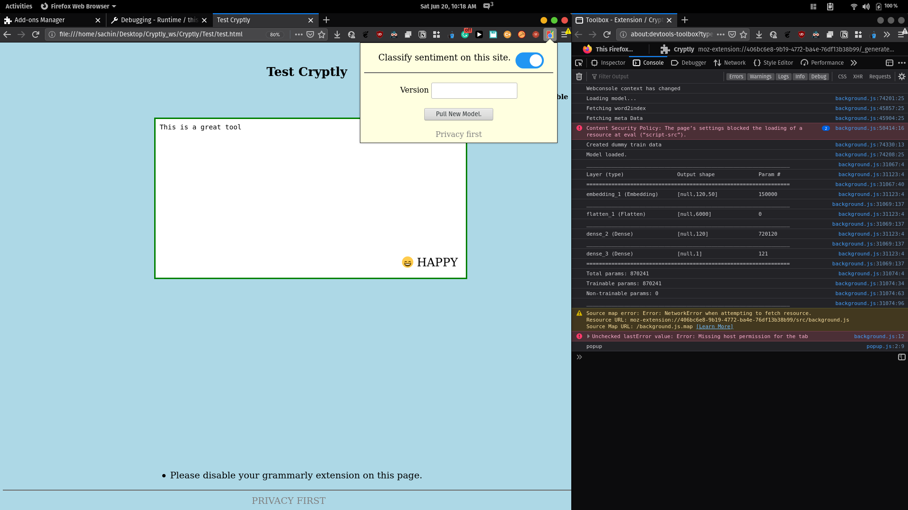
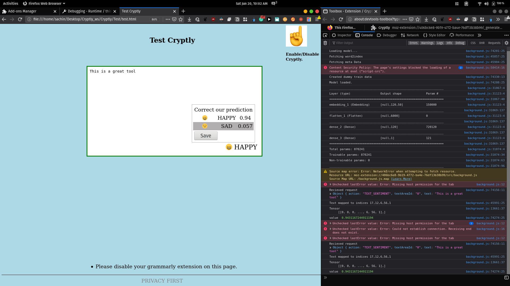
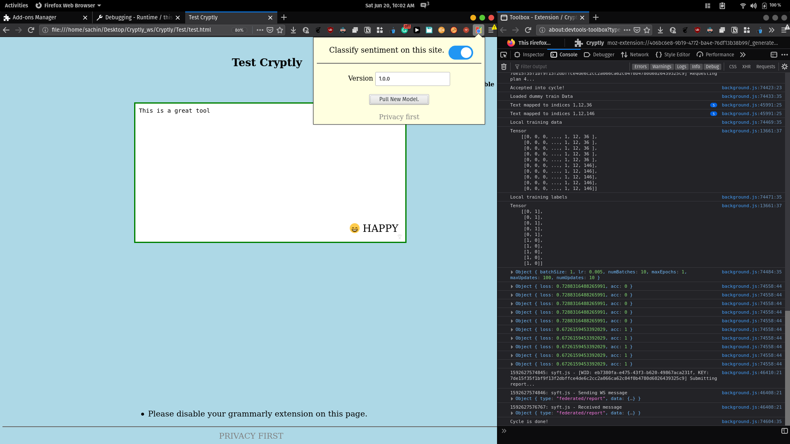

# Cryptly
A privacy-preserving browser extension. 

## How it works?
- Your input data remains on your local machine.
- The browser extesion loads a local model for inference.
- This model predicts the sentiment(positive/negative stuff..) of your input text on websites. (Yes, it works similar to grammarly.)
- But your data is not uploaded to a central server.
- The model predictions can be corrected using an interactive panel. The corrections are stored locally.
- You can fetch updated models from the grid, which trains on the  local data (the corrections made by you).
- A copy of the latest global model is saved on your device, which will be used for inference locally.
- The updated model is sent back to the grid.
- With multiple users correcting the model on a regular basis, the performance of the model imoproves exponentially, and everyone can benefit from it.

## How to Test?
- Clone the repo. :)
- Install [PySyft](https://github.com/OpenMined/PySyft), [PyGrid](https://github.com/OpenMined/PyGrid) and [Syft.js](https://github.com/OpenMined/Syft.js).
- The extension has been tested in `Firefox`.
- `cd server && python app.py` (more info in server/readme.md)
    - This serves the initial model to Cryptly (our extension).
- Start the pygrid `Gateway` using `python grid.py --host localhost --port 5001 --start_local_db`.
    - Notice the port is `5001` (cuase the above server is already running on `5000`).
- Run the `Grid/Host Plan.ipynb` to host models to pygrid.
- `npm i && npm run build` to built cryptly.
- `Ctrl+Shift+A` and go to `Settings -> Debug Add-ons > Load Temporary Add-on`.
- Click on `inspect` to open the console attached to the extension.
- Select the `Cryptly/dist/manifest.json` to load the extension.
- Open `Test/test.html` in your browser (Firefox).
- Cryptly is enabled by default on new websites.
- Open console by pressing `F12`.
- Type in text area, and you should see an emoji displaying the sentiment of your text.
- Click on the emoji to see the confiedence of the predictions made by the model. Click on save to go back.
- To pull the hosted model, click on the `Cryptly` icon in the `Toolbar` menu of the browser.
- Enter version number (if you haven't changed it in `Host Plan.ipynb` then it is `1.0.0`).
- Click on `Pull new model` to fetch the hosted model and train on local data. (Note: As of now the fetched model trains on dummy data.)

* Note: Disable the extension after testing. ;) Cause it may make your text area elements go crazy on other websites.

## Demo:

<figure>
    
    <figcaption>
    Type in the TextArea and Cryptly will display an emoji depicting the sentiment of your input text. You can enable/disale Cryptly on a website using the extension popup.
    </figcaption>
</figure>

<figure>
    
    <figcaption>
    You can correct Cryptly's predictions. The corrections are stored locally and serve as training data for Cryptly models.
    </figcaption>
</figure>

<figure>
    
    <figcaption>
    You can pull the updated model from grid using the extension popup. This updated model has been trained on the corrections provided by multiple users of Cryptly. The pulled model replaces your local model and provides better predictions.
    </figcaption>
</figure>

## Resources:
- Awesome explanation of [Federated Learning by Web & Mobile team @OpenMined](https://github.com/OpenMined/Roadmap/blob/master/web_and_mobile_team/projects/federated_learning.md).

## Acknowledgements:
- Thanks to developers of [PySyft](https://github.com/OpenMined/PySyft), [PyGrid](https://github.com/OpenMined/PyGrid) and [Syft.js](https://github.com/OpenMined/Syft.js).
- Thanks [Vova Manannikov](https://github.com/vvmnnnkv) for his quick fixes and help in integrating Syft.js.